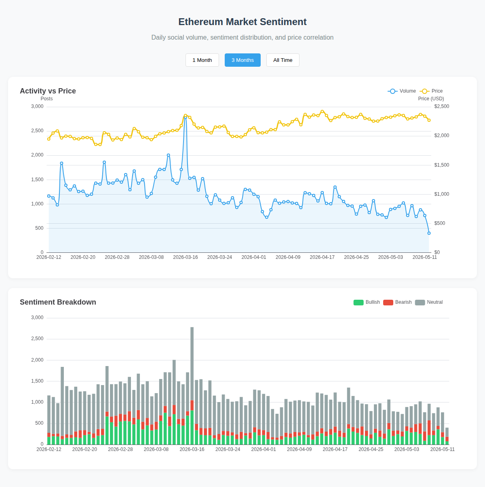

# ETH_Discussion_Data
A public repository containing Ethereum-related discussion data collected from the internet.

  
  

 

## 📊 Live Dashboard Preview
*This image is automatically updated every 24 hours via GitHub Actions.*

---

### 🚀 Project Overview
This repository provides a fully automated pipeline for:
1. **Data Collection:** Daily scraping of ETH discussions (stored in `data_collect/`).
2. **Sentiment Analysis:** Processing text with NLP models to identify market sentiment.
3. **Price Correlation:** Fetching real-time ETH prices via Yahoo Finance.
4. **Visualization:** Interactive dashboard built with ECharts and deployed via GitHub Pages.

[View Full Interactive Version](https://benjamin-fairy.github.io/ETH_Discussion_Data/)
